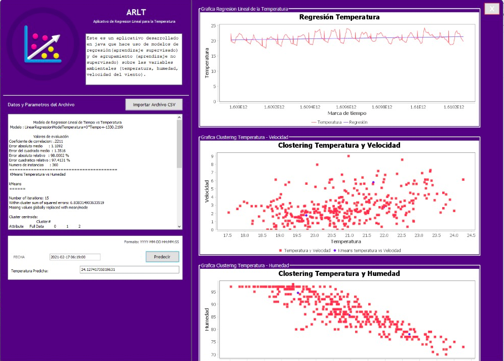

# ARAT

ARAT is a tool to predict some variables such as temperature, wind speed and humidity, using tools like Weka

# Members!

  - Sergio Mercado G
  - Luis Agudelo
  - Osnaider Miranda C

### Tech

The use of Netbeans is required for the execution of this project

 
